<!-- .slide: data-background="media/img/lets-try-webvr.jpeg" -->

<div class="talk-title">
  <p class="talk-info" style="top:270px">
    @salad_milk_soup | Archilogic / 3d.io 
  </p>
</div>

<!-- NOTES -->
- Onboard web developers into the 3D and VR world with easy-to-use tools
- Prototype WebVR experiences faster

------

# Who's talking


Monika Kedrova, Software Engineer @Archilogic / 3d.io 

------

# Who's talking
<!-- .slide: data-background-video="media/video/monika-hololens.mp4" autoplay -->
<div style="display:inline-block; float:left; width: 45%; font-size:0.8em"><br>
  <p class="talk-info" style="top:20%" >
  Monika Kedrova<br><br>
  Biologist &rarr; English teacher &rarr; software engineer<br><br>
  @salad_milk_soup
  </p>
</div>


 <!--<video src="media/video/monika-hololens.mp4" autoplay loop></div>
 <div style="display:inline-block; offset: 50%; width: 40%">
<div class="image-row">
  <div></div>
</div>-->


<!-- NOTES -->
-  bla-bla 

------

# Virtual Reality

<!-- .slide: data-background="media/img/vr-driving.jpg" -->

<!-- NOTES -->
- Ask how many have tried VR.
- Virtual reality is a technology platform that transports you to realistic, interactive, immersive 3D environments
- It's the next platform, will change how we work + play + communicate digitally, face of society

------

# Why VR?

------

<!-- .slide: data-background="media/img/birdly.gif" -->

<p class="talk-info" style="font-size:1.6em"> Immersion </p>

------

<!-- .slide: data-background="media/img/tilt-brush.gif" -->

<p class="talk-info" style="font-size:1.6em"> Imagination </p>

------

<!-- .slide: data-background="media/img/360tours.gif" -->

<p class="talk-info" style="font-size:1.6em"> Exploration </p>

------

## VR has been around for a while...

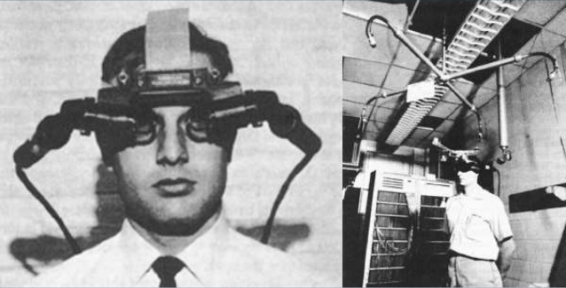

------

## Main areas of use

<div class="slide__boilerplate">
  <p>Entertainment / Gaming</p>
  <p>Education & training</p>
  <p>Healthcare</p>
  <p>Marketing</p>
  <p>Tourism</p>
  <p>Art</p>
  <p>Architecture / real estate</p>
</div>

------

# Education

<!-- .slide: data-background="media/img/cadavr.gif" -->

------

<!-- .slide: data-background="media/img/mars.jpg" -->

# Journalism - *Journey to Mars*

The Washington Post

------

# Gaming - *A-Blast*

@mozillavr

<!-- .slide: data-background="media/img/a-blast.gif" -->

------

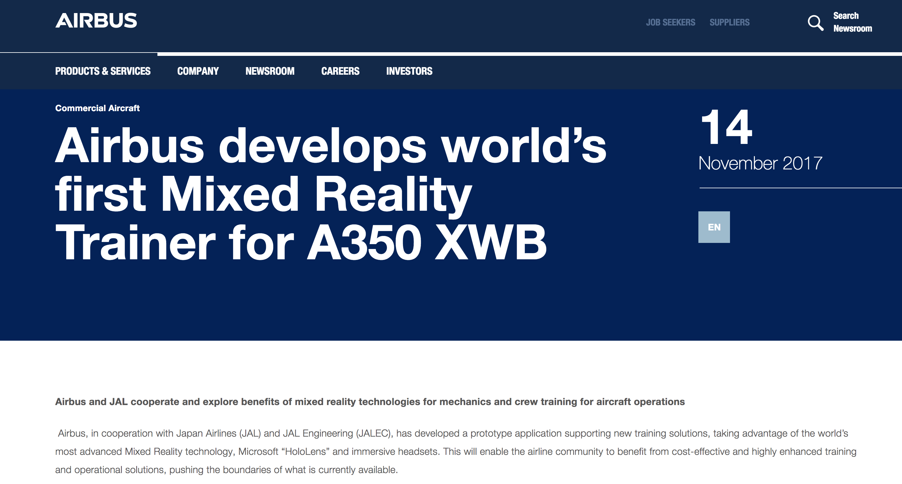</img>
<video style="top:100px" src="media/video/engine2.mp4" autoplay loop ></video>

------

## New landscape

<div class="image-row">
  <div></div>
  <div>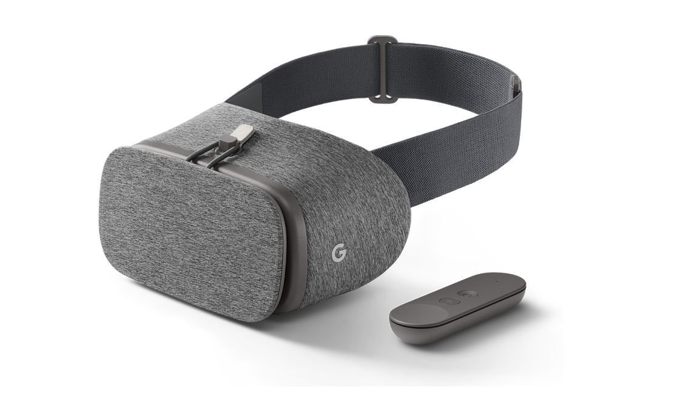</div>
  <div></div>
</div>

<div class="image-row">
  <div></div>
  <div></div>
  <div></div>
</div>

<!-- NOTES -->
- Backed by the largest corporations in the world, everyone wants in
- Range from cheap to expensive, tethered and untethered, controllers, tracking
- HTC Vive with Steam currently offers the most compelling experiences, but never know
- See a lot of different devices, systems, platforms competing against each other...

------

## Accessibility

Who has access to virtual reality?

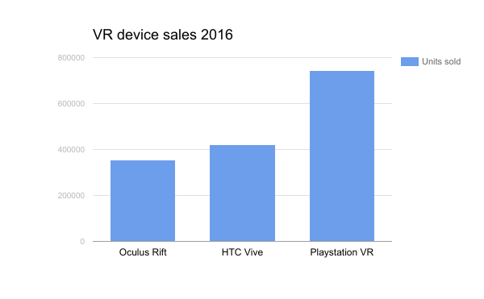

------

## Accessibility

Who has access to virtual reality?

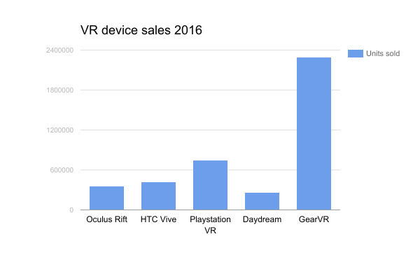

------

## Accessibility

Who has access to virtual reality?

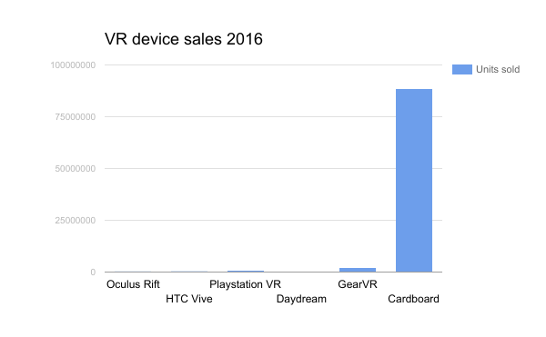

<!-- NOTES -->
Want to get widespread use:

Progressive enhancement:

Maintaining consistent frame rate & user friendly experience regardless of different inputs and across platforms with various performance capabilities
* From fast high end desktop computers with advanced controllers and tracking
* To low end smartphones with no positional tracking and no controllers

------

##  Challenges

<div class="captioned-image-row">
  <div>
    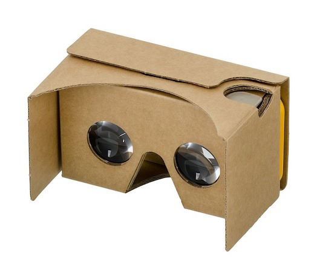
    <i>Varying capabilities</i>
  </div>
  <div>
    
    <i>Installs</i>
  </div>
  <div>
    
    <i>Siloed content</i>
  </div>
</div>

<!-- NOTES -->
Types of interaction:
* Gaze  (cardboard)
* Gaming controllers (xbox, playstation)
* rotation tracking controllers (daydream, gearvr) - laser like pointer
* Position and rotation tracking controllers (htc vive, oculus touch)
* Hand gesture based controls (hololens)


- App stores and corporations control distribution: can take down or block content
- Downloads / installs are a barrier to consumption: small business pages
- Closed ecosystem: proprietary engines, steep learning curves, siloed experiences, fragmentation
- We want VR to be successful, so we want a platform without these points of friction. The answer is WebVR...

------

# WebVR API

<div class="captioned-image-row">
  <div>
    
    <i>Detect headsets</i>
  </div>
  <div>
    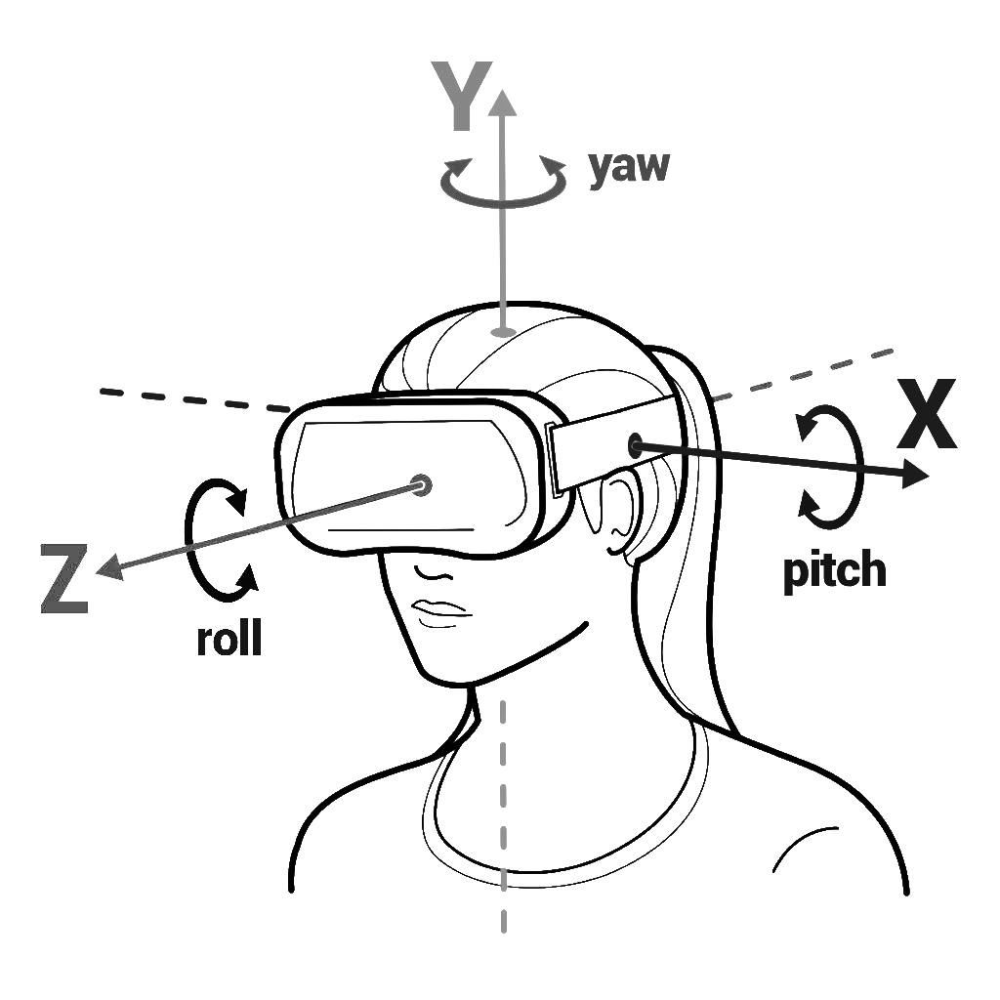
    <i>Orientation / position</i>
  </div>
  <div>
    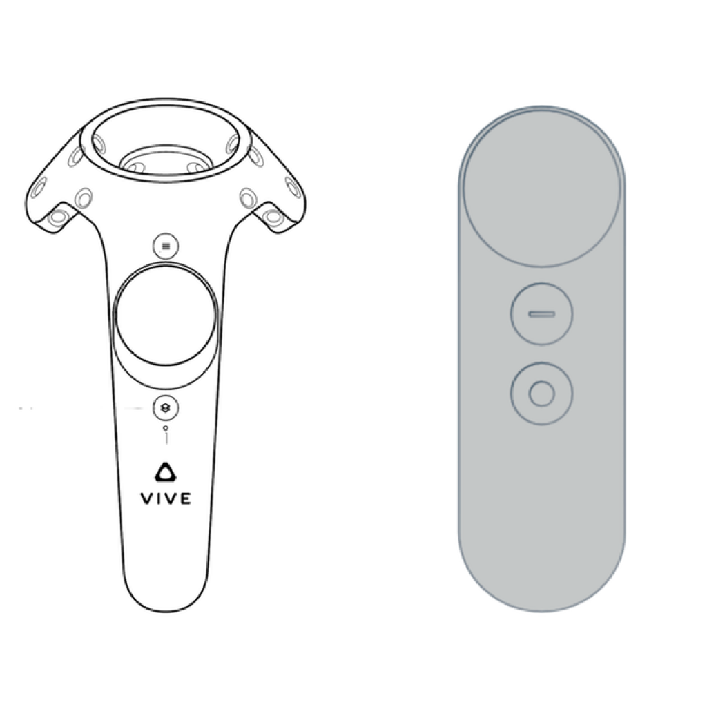
    <i>Controllers</i>
  </div>
</div>

<!-- NOTES -->
WebVR is...virtual reality in the browser, powered by the Internet

Cross-browser Javascript API that provides interface to VR hardware and makes immersive 3D on the web possible
    * Headset tracking - position of head & frame interpolation
    * “Six degrees of freedom” and “three degrees of freedom” controller support
* 
* First developed in 2014 @mozilla
* From 2016 first version of standard available on desktop Chrome, Firefox & 
Samsung Internet for GearVR
* Now the support is much wider:
    * WebVR standards are worked on in the open collaboratively by all major players - 
    Mozilla, Google, Oculus (Facebook), Microsoft, Samsung..
* Better than native VR (app stores & downloads)
* Current version 1.1 
* Now discussions about creating a WebVR working group within the W3C.

* Low barrier of entry:
* No big commitment so ok to just try out - not necessary to stick to one type of device and content that’s only available for it (dedicated hw)
* No downloads / App Store
    * This works for games because of willingness to invest and the fact that people return again and again (vive & steam)
* Experience easy to share, distribute - just one URL
Open:
- Anyone can publish
- Open source culture with open standards

Connected:
- Traverse worlds

Instant:
- Click a link on Twitter or Weibo, immediate VR experiences
- No installs
- Imagine for long tail experiences: shopping & personal spaces
- Great for long tail bite-sized experiences

Transition:
- Web has advantages that make it the best platform for the people
- Need to act to make it reality, can't wait for VR to bake and crystallize
- Get involved

API:
- Optimized rendering path to headsets
- Access position and rotation (pose) data

History:
- Initial WebVR API by Mozilla
- Working W3C community group
- Mozilla, Google, Samsung, Microsoft, community currently iterating WebVR 1.0 API

Not just a specification, it's implemented...

------

## Support


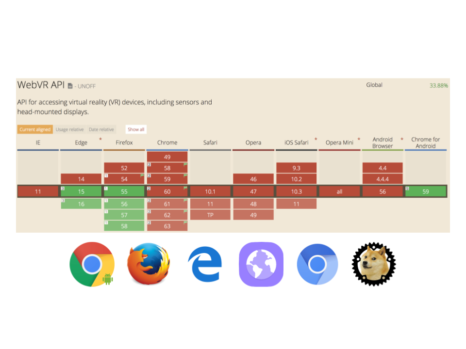
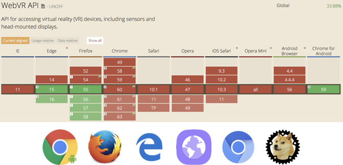

---

## Support

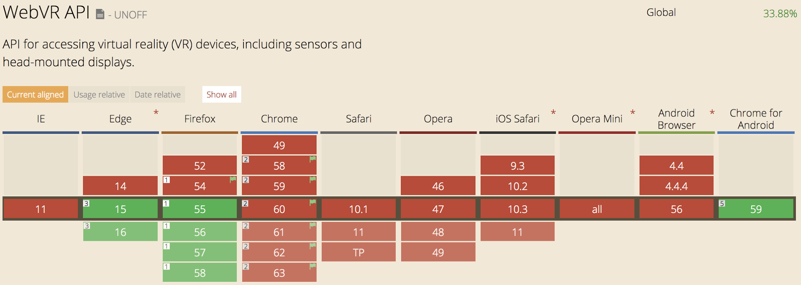

------

## Let's build something!


<div class="captioned-image-row">
  <div>
    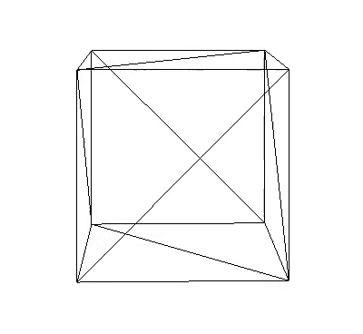
    WebGL
  </div>
  <div>
    
    WebVR
  </div>
</div>

------

<!-- .slide: data-background-video="media/video/boilerplate.mp4" data-state="state--bg-dark" loop="true" -->

<div class="slide__boilerplate">
  <p>Import WebVR polyfill</p>
  <p>Set up camera</p>
  <p>Set up lights</p>
  <p>Initialize scene</p>
  <p>Declare and pass canvas</p>
  <p>Listen to window resize</p>
  <p>Install VREffect</p>
  <p>Instantiate renderer</p>
  <p>Create render loop</p>
  <p>Preload assets</p>
  <p>Figure out responsiveness</p>
  <p>Deal with metatags and mobile</p>
</div>

<!-- NOTES -->
- It's still too difficult to create WebVR experiences
- Huge obstacle if doing small prototypes and experiments
- Boilerplate needs updating with new versions of WebVR, three.js, and browser quirks
- Encapsulate all of that into one line...

------

# A-Frame

<!-- .slide: data-background="media/img/aframe-rendered-full.png" -->

A web framework for building virtual reality experiences

<!-- NOTES -->
- Launched last December
- Why:
  - Easy for web developers to create VR content, without graphics knowledge
  - Prototype and experiment WebVR and VR UX faster
  - Vehicle to kickstart WebVR ecosystem

---

## Hello World

<!-- .slide: data-background="media/img/aframe.jpg" data-transition="slide-in none" -->

```html
<html>
  <script src="https://aframe.io/releases/0.7.0/aframe.min.js"></script>
  <a-scene>


  </a-scene>
</html>
```
<!-- .element: class="stretch" -->

<!-- NOTES -->
- Just HTML
- Drop a script tag, no build steps
- Using Custom HTML Elements
- One line of HTML `<a-scene>` handles
  - canvas, camera, renderer, lights, controls, render loop, WebVR polyfill, VREffect
- Put stuff inside our scene...

---

## Hello World

<!-- .slide: data-background="media/img/aframe.jpg" data-transition="fade-in slide-out" -->

```html
<html>
  <script src="https://aframe.io/releases/0.7.0/aframe.min.js"></script>
  <a-scene>
    <a-box color="#4CC3D9" position="-1 0.5 -3" rotation="0 45 0"></a-box>
    <a-cylinder color="#FFC65D" position="1 0.75 -3" radius="0.5" height="1.5"></a-cylinder>
    <a-sphere color="#EF2D5E" position="0 1.25 -5" radius="1.25"></a-sphere>
    <a-plane color="#7BC8A4" position="0 0 -4" rotation="-90 0 0" width="4" height="4"></a-plane>
    <a-sky color="#ECECEC"></a-sky>
  </a-scene>
</html>
```
<!-- .element: class="stretch" -->

<!-- NOTES -->
- Basic 3D primitives with Custom Elements
- Readable: HTML arguably most accessible language in computing
- Encapsulated: copy-and-paste HTML anywhere else and still work, no state or variables
- Quickly look at a live example...

---

<div data-aframe-scene="scenes/demo.html"></div>
<!-- .element: class="stretch" -->

------

<!-- .slide: data-background="media/img/architecture.jpg" data-transition="fade-in slide-out" -->

------

## Works With Everything

<div class="captioned-image-row">
  <div>
    
    <i>d3.js</i>
  </div>
  <div>
    
    <i>Vue.js</i>
  </div>
  <div>
    
    <i>React</i>
  </div>
  <div>
    
    <i>Redux</i>
  </div>
  <div>
    
    <i>jQuery</i>
  </div>
  <div>
    
    <i>Angular</i>
  </div>
</div>

<!-- NOTES -->

- Based on HTML, compatible with all existing libraries/frameworks
- Good reason to have HTML as an intermediary layer between WebGL/three.js
- All tools were on top of the notion of HTML
- Under the hood, A-Frame is an extensible, declarative framework for three.js...

------

# Component system 

------

<!-- .slide: data-background="media/img/standard-components.png" data-background-size="contain" -->


<!-- NOTES -->
- These are some components that ship with A-Frame
- A-Frame is fully extensible at its core so...

------

<!-- .slide: data-background="media/img/community-components.png" data-background-size="contain" -->

<!-- NOTES -->
- Community has filled the ecosystem with tons of components
- Components can do whatever they want, have full access to three.js and Web APIs
- The component ecosystem the lifeblood of A-Frame
- Physics, leap motion, particle systems, audio visualizations, oceans
- Drop these components as script tags and use them straight from HTML
- Advanced developers empowering other developers
- Working on collecting these components...

------

## Look into the future: Web AR

<div style="display:inline-block; float:left; width: 45%">
    <video src="media/video/ar-furniture-lake-1.mp4" autoplay loop></video>
</div>
<div style="display:inline-block; offset: 50%; width: 45%" >
    <video src="media/video/ar-furniture-lake-2.mp4" autoplay loop></video>
</div>

---

<iframe width="560" height="315" src="https://www.youtube.com/embed/PzfAefrG7iM" frameborder="0" allowfullscreen></iframe>
<!---->

------

# More resources

* aframe.io/aframe-school
* appcreator.3d.io
* bit.ly/making-webvr-vlog
* aframe.io/blog

------

# Thank you!

* Web:				3d.io
* Blog:				medium.com/archilogic
* Twitter:			@archilogic3d @salad_milk_soup


